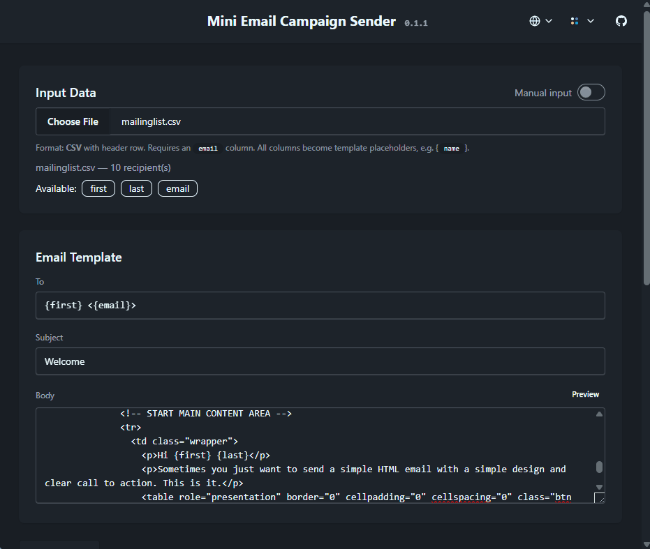

# Mini Email Campaign Sender

Send personalized email campaigns via SMTP or Amazon SES, with real-time progress tracking, pause/resume, retry logic, and a clean web interface.

<p align="center">
  
</p>

## Features

- **CSV input** via file upload (100MB+) or manual paste, with header-based `{placeholder}` personalization
- **Pre-configured defaults** from `config.yaml` — all settings overridable per campaign in the web UI
- **Dry-run preview** — render sample emails in sandboxed iframes (Render/Code tabs) without sending
- **Email providers** — SMTP, SES, and SES Templates (see [Supported Providers](#supported-providers) below)
- **Worker pool** — concurrent goroutines with per-worker dedicated sender instances
- **Retry logic** — exponential backoff with configurable max attempts and base/max durations
- **Pause / Resume** — graceful pause (in-flight email completes), resume processes only pending recipients
- **Real-time progress** — SSE stream pushes progress bar + log events to frontend every 1s
- **Session restore** — page refresh restores in-progress campaign state
- **Campaign logging** — optional per-run JSON log file with full configuration and delivery tracking
- **Verbose mode** — per-email debug details in frontend and log file
- **Single binary** — Svelte 5 frontend embedded in Go binary via `//go:embed`

## Supported Providers

| Provider          | Method                   | Batch                   | Description                                                                                    |
| ----------------- | ------------------------ | ----------------------- | ---------------------------------------------------------------------------------------------- |
| **SMTP**          | `DialAndSend`            | ✅ configurable (1–500) | Direct SMTP connection, batched per connection for throughput                                  |
| **SES**           | `SendRawEmail`           | ❌ per-email            | Raw email sending via Amazon SES API                                                           |
| **SES Templates** | `SendBulkTemplatedEmail` | ✅ configurable (1–50)  | Marketing emails via SES templates; subject/body from template, CSV data as template variables |

## Download

You can try latest pre-built binaries from the [releases page](https://github.com/raditzlawliet/mini-email-campaign-sender/releases).

## Quick Start

```bash
# Run on Linux
chmod +x ./mecs
./mecs

# Run on Windows
./mecs.exe
```

Open [http://localhost:8080](http://localhost:8080) in your browser.

## Configuration

By default if no config provided, it will automatically created `config.yaml`.
You can edit `config.yaml` to set defaults for server, email provider, worker pool, and logging:

```yaml
server:
  port: 8080

email:
  provider: smtp # "smtp" or "ses"
  from: "sender@example.com"
  smtp:
    host: "localhost"
    port: 1025
    username: ""
    password: ""
    tls: false
    batch_size: 50
  ses:
    region: "us-east-1"
    access_key_id: ""
    secret_access_key: ""
    use_template: false
    template_name: ""
    batch_size: 50

worker:
  concurrency: 10
  max_retries: 3
  retry_backoff_base: "1s"
  retry_backoff_max: "30s"

log:
  campaign:
    log_to_file: true # write campaign events to logs/campaign_*.log
    verbose: false # include per-email debug detail
```

| Section        | Key                  | Default     | Description                     |
| -------------- | -------------------- | ----------- | ------------------------------- |
| `server`       | `port`               | `8080`      | HTTP server port                |
| `email`        | `provider`           | `smtp`      | Email provider: `smtp` or `ses` |
| `email`        | `from`               | —           | Sender email address            |
| `email.smtp`   | `host`               | `localhost` | SMTP server hostname            |
| `email.smtp`   | `port`               | `1025`      | SMTP server port                |
| `email.smtp`   | `username`           | —           | SMTP auth username (optional)   |
| `email.smtp`   | `password`           | —           | SMTP auth password (optional)   |
| `email.smtp`   | `tls`                | `false`     | Enable TLS                      |
| `email.smtp`   | `batch_size`         | `50`        | Emails per SMTP connection      |
| `email.ses`    | `region`             | —           | AWS region (e.g. `us-east-1`)   |
| `email.ses`    | `access_key_id`      | —           | AWS access key ID               |
| `email.ses`    | `secret_access_key`  | —           | AWS secret access key           |
| `email.ses`    | `use_template`       | `false`     | Use SES template (marketing)    |
| `email.ses`    | `template_name`      | —           | SES template name               |
| `email.ses`    | `batch_size`         | `50`        | Emails per Bulk API call (1–50) |
| `worker`       | `concurrency`        | `10`        | Parallel worker goroutines      |
| `worker`       | `max_retries`        | `3`         | Max retry attempts per email    |
| `worker`       | `retry_backoff_base` | `1s`        | Initial retry delay             |
| `worker`       | `retry_backoff_max`  | `30s`       | Max retry delay cap             |
| `log.campaign` | `log_to_file`        | `true`      | Write per-run JSON log file     |
| `log.campaign` | `verbose`            | `false`     | Enable debug-level detail       |

## Development

### Prerequisites

- Go 1.22+
- Node.js 20+
- [Mailpit](https://github.com/axllent/mailpit) (for email testing)

### Run in development mode

```bash
# Terminal 1: Backend (API only + CORS for :5173)
make dev-be

# Terminal 2: Frontend (Vite HMR, proxies /api to :8080)
make dev-fe
```

Open [http://localhost:5173](http://localhost:5173) in your browser.

### Email testing with Mailpit

```bash
docker run -d -p 1025:1025 -p 8025:8025 --name mailpit axllent/mailpit
```

Web interface at [http://localhost:8025](http://localhost:8025) to view captured emails.

### Running tests

```bash
make test                 # Unit tests
make test-integration     # Integration tests (requires Mailpit)
```

## Build

```bash
make build
```

Produces a single binary at `bin/mecs` (`bin/mecs.exe` on Windows) with the frontend embedded.

## Makefile Targets

| Target                  | Purpose                               |
| ----------------------- | ------------------------------------- |
| `make build`            | Build frontend + embed + Go binary    |
| `make dev`              | Production mode single binary         |
| `make dev-be`           | Backend only (API + CORS for `:5173`) |
| `make dev-fe`           | Vite dev server with HMR              |
| `make test`             | `go test ./...`                       |
| `make test-integration` | Integration tests                     |
| `make clean`            | Remove build artifacts                |

## Architecture

```
cmd/server/              # Entry point, embeds frontend, SSE
internal/
  config/                # YAML configuration
  handler/               # HTTP handlers (Go Fiber v3) + multipart parsing
  worker/                # Worker pool, retry, RunPending for resume
  email/                 # SMTP (batched) & SES senders, template rendering
  store/                 # In-memory campaign state, event log, verbose flag
  campaign/              # CSV parsing, campaign orchestration, file logging
frontend/                # Svelte 5 + TailwindCSS v4 + DaisyUI v5
```

## API Endpoints

| Method | Path                    | Purpose                                                  |
| ------ | ----------------------- | -------------------------------------------------------- |
| GET    | `/api/campaign/config`  | Return default config + campaign state (session restore) |
| POST   | `/api/campaign/preview` | Parse CSV (multipart) + render N sample emails           |
| POST   | `/api/campaign/start`   | Parse CSV (multipart) + start worker pool                |
| POST   | `/api/campaign/pause`   | Gracefully pause campaign                                |
| POST   | `/api/campaign/resume`  | Resume pending recipients                                |
| GET    | `/api/campaign/events`  | SSE stream: progress + log every 1s                      |
| POST   | `/api/campaign/reset`   | Clear all campaign state                                 |

## Campaign Flow

1. **Input Data** — Upload a `.csv` file or paste CSV manually. First row is headers, requires an `email` column. Available headers shown as copyable badges.
2. **Email Template** — Configure To, Subject, and Body with `{placeholder}` variables matching CSV headers.
3. **Email Provider** — Select SMTP or SES (defaults from `config.yaml`). Override host, port, credentials, TLS, and batch size per campaign. SES supports template mode for marketing emails — when enabled, subject/body are defined by the SES template and CSV data becomes template variables, sent via batched `SendBulkTemplatedEmail`.
4. **Worker Config** — Adjust concurrency, max retries, and backoff settings.
5. **Log Config** — Toggle per-run file logging and verbose debug output.
6. **Dry-Run Preview** — Render sample emails in sandboxed iframes (Render/Code tabs) without sending.
7. **Start Campaign** — Begin sending. Real-time progress bar and log stream via SSE.
8. **Pause / Resume** — Pause gracefully (in-flight email completes). Resume processes only pending recipients.
9. **Reset** — Clear all state and start fresh.

## Campaign Logs

Each campaign run can write a structured JSON log file at `logs/campaign_<timestamp>.log`:

- Set `log.campaign.log_to_file: false` to disable file logging
- Set `log.campaign.verbose: true` to include debug-level per-email events

## Contributors

Contributions are welcome! Check the [Issues](https://github.com/raditzlawliet/mini-email-campaign-sender/issues) page or open a Pull Request.

<div align="center">
    <a href="https://github.com/raditzlawliet/mini-email-campaign-sender/graphs/contributors">
        
    </a>
</div>

## License

MIT
